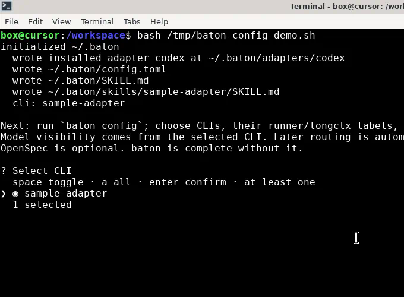
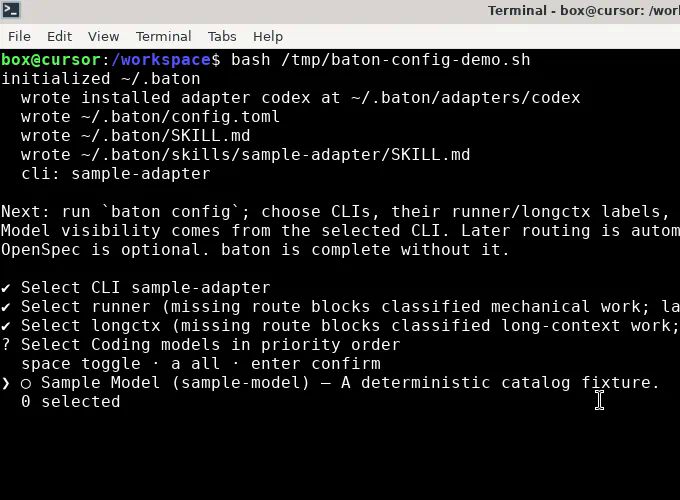
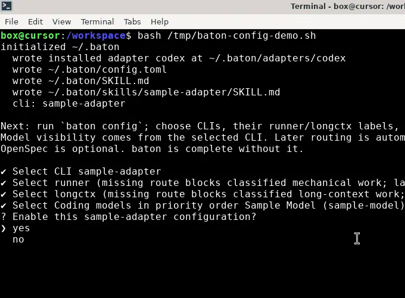

# baton

<p align="center"></p>

**English** | [中文](README.zh.md)

Baton is a CLI-neutral, manifest-driven scheduling and policy layer. It keeps
the director conversation focused, chooses from the selected adapter's live
catalog, and runs authorized work through native child execution.

Subagent capacity belongs to one root-agent tree, identified by the hashed
`BATON_SESSION_ID`. The root itself is excluded from the count; direct children,
grandchildren, and deeper descendants share the same tree-local pool.

The package can run standalone or consume a structured change plan when one is
available. It requires Node.js 22.5 or newer.

```bash
npm install -g @zhouliuya/openbaton
baton init
baton config
```

`baton config` is a guided TTY flow: arrow keys select, space toggles CLIs
and the Coding-model order. It asks which adapter to enable, then `runner`,
`longctx`, and `coding_models`. Pass flags only to skip the prompts.







These captures use the in-repo `sample-adapter`. The prompts are the same for
Codex; the model list comes from that adapter's live catalog.

## Source checkout

From a checkout, build and refresh the linked command with:

```bash
python3 scripts/update_local_baton.py
```

The script installs dependencies, runs the repository checks, builds the
package, links `baton`, and refreshes the shared runtime files. Use
`--skip-tests` only when you have explicitly accepted that verification is
omitted. The day-to-day checkout command is:

```bash
bun install
bun run baton -- <command> ...
```

Core has no built-in catalog. An adapter package is discovered from
`adapter.json` under `~/.baton/adapters/<adapter-id>/` or
`BATON_ADAPTER_PATHS`. There is no interactive model-choice step during
execution.

## Getting started

An isolated walkthrough lives at [`samples/getting-started/`](samples/getting-started/).
It uses the in-repo `sample-adapter`, so you can run init through dispatch
without a paid host.

From the repository root:

```bash
bun samples/getting-started/walkthrough.mjs
```

Or follow [samples/getting-started/README.md](samples/getting-started/README.md).

## Measured OpenSpec apply

One completed change, `scope-subagent-capacity-per-agent-tree`, was applied
through Baton with native subagents. The change scoped dispatch capacity to
one immutable `(host, session_uid)` root-agent tree: session identity,
tree-local slots, status provenance, cross-tree safety isolation, adapter
quota wording, and installed-runtime acceptance.

### Task scale

| Dimension | Size |
|---|---|
| OpenSpec work | 7 sections, 30 tasks |
| Spec contract | 10 requirements, 26 scenarios |
| Implementation commit `2aca248` | 46 files, +3,293 / −246 |
| Source verification | 223 tests passed, 1 skipped |

### Execution

The comparison excludes 33m36s of unrelated compatibility-gate wait from
another task. Amounts are public-API equivalent cost, not a subscription
invoice. The solo-director row is a counterfactual: the same productive
token volume priced and serialized on `gpt-5.6-sol`, not a second live run.

| | Solo director estimate | Baton (1 director + 36 subagents) |
|---|---|---|
| Models | `gpt-5.6-sol` throughout | director `gpt-5.6-sol` (`high`, 3 auto-compacts); subagents `gpt-5.6-luna` (no auto-compacts) |
| Effective wall clock | 2h 34m 33s | 1h 58m 05s (−36m 28s, 1.31×) |
| Productive tokens | ~137.16M | ~137.16M |
| API-equivalent cost | $79.70 | $30.56 (−$49.14, −61.7%) |

Subagents carried more than half of the tokens; at `gpt-5.6-luna` prices
their combined equivalent cost was about $2.66.

## Using Baton inside Codex

### Setup

```bash
npm install -g @zhouliuya/openbaton
# or from a checkout: bun run baton -- <command> ...
baton init --cli codex
```

`baton init --cli codex` installs bundled adapters and host skills. The Codex
adapter manifest (`adapters/codex/adapter.json`) copies `runtime/SKILL.md` to
`.codex/skills/baton/SKILL.md`. That is how Codex sees Baton.

Then run `baton config --cli codex`. On a TTY it is a guided flow: arrow keys
select, space toggles. It walks through `runner`, `longctx`, Coding-model
priority, and whether to enable the profile. Model ids come from the live
Codex CLI catalog (`BATON_CODEX_PATH` if Codex is not on `PATH`).

Flags skip the prompts for non-interactive use and write only `[cli.codex]`:

```bash
baton config --cli codex --runner <model-id> --longctx <model-id> --coding-model <model-id> --enable
```

Turn activation on or off with:

```bash
baton enable|disable all|curproject --host codex
```

When activation is effectively disabled, `spawn` and `apply` create no tickets
(bypass). Ticket commands need `BATON_SESSION_ID` (opaque; hashed to
`session_uid`). The Codex director creates one before the first control-plane
call.

### When Baton auto-triggers (current version)

This is **current-version** behavior. Later versions are not intended to
auto-trigger.

After init installs `.codex/skills/baton/SKILL.md` and the Codex profile is
enabled with activation on, the Codex director conversation follows that skill:

- Discussion and read-only analysis stay in the Codex director session. These
  do **not** create Baton tickets.
- Authorized implementation, mechanical, long-context, and OpenSpec units are
  supposed to go through Baton (`spawn`/`apply` plus a native Codex child),
  not be implemented inline in the director.

That skill-following is the current auto-trigger. The auto path still requires
a director **structured classification**. Baton does not infer a route from
prose. Missing classification blocks ticket creation on an enabled host.

### Manual trigger

You or the director can run the CLI yourselves:

```bash
export BATON_SESSION_ID="<opaque-session>"
baton models refresh --host codex
baton match "<work description>" --host codex
baton spawn "<request>" --host codex --classification <class> [--write-path ...]
baton dispatch next --host codex --json
# bind the Codex native handle:
baton dispatch bind TICKET --host codex --execution-handle task_name=CODEX_TASK_NAME --json
baton dispatch complete TICKET --host codex --text "..." --release --json
```

`baton apply` plans an OpenSpec change. `--dispatch` needs per-unit
`--write-path` or `--read-only`. Without OpenSpec, use `spawn`.
`baton match` discloses the preferred model without creating work.

### What runs where

`--classification` is required on an enabled host:
`mechanical|long-context|implementation|analysis|discussion|general`.

- `discussion` / `analysis` → director only. No worker ticket.
- `mechanical` → configured `runner` label. Empty runner blocks; classified
  mechanical work is not executable on the director. Commit-only capability
  is mechanical only.
- `long-context` → configured `longctx` label. Empty longctx blocks.
- `implementation` and `general` → automatic selection over the ordered
  `coding_models` allowlist (Coding priority). `general` is `not-ops` for
  runner/longctx. `runner` and `longctx` are labels, not Coding-priority
  entries.

`--operation` is audit metadata only; it never selects a route.

Deep lifecycle stays in [docs/guide.md](docs/guide.md).

## First session

Ticket-producing and capacity-sensitive dispatch commands require
`BATON_SESSION_ID`. Baton hashes that value into `session_uid` and keeps the
same identity for the root and every descendant.

```bash
export BATON_SESSION_ID="<opaque-session>"
baton models refresh --host <adapter-id>
baton match "<work description>" --host <adapter-id>
baton spawn "<request>" --host <adapter-id> --classification <class>
baton dispatch next --host <adapter-id> --json
baton dispatch status --host <adapter-id> --json
baton dispatch complete <ticket> --host <adapter-id> --text "<conclusion>" --release --json
```

`baton apply` plans an OpenSpec change. `--dispatch` requires per-unit
`--write-path` or `--read-only`. Without OpenSpec, use `baton spawn`.

Automatic routing uses only the enabled profile's `coding_models` allowlist,
the live catalog, task shape, supported reasoning options, service-tier
metadata, route health, and capacity evidence.

## Commands

```text
baton init
baton config --cli <adapter-id> --enable
baton models refresh --host <adapter-id>
baton models status --host <adapter-id>
baton match "<work description>" --host <adapter-id>
baton spawn "<request>" --host <adapter-id> --classification <class>
baton apply <change> --host <adapter-id>
baton dispatch next --host <adapter-id> [--capacity <n>] --json
baton dispatch status --host <adapter-id> [--capacity <n>] --json
baton dispatch complete <ticket> --host <adapter-id> --text "<conclusion>" --release --json
```

`dispatch status` is scoped to the current root tree. General `baton status`
keeps workspace ticket inventory but groups capacity under `capacity_trees`.

## Documentation

- [Getting started](samples/getting-started/README.md) — isolated init through dispatch
- [Samples](samples/README.md) — adapter manifest sample and acceptance shape
- [Product guide](docs/guide.md) — adapter SDK, configuration, scheduling,
  ticket lifecycle, safety, and the measured OpenSpec apply
- [Architecture notes](docs/architecture/baton-dynamic-director.md)
- [Architecture diagram](docs/architecture/openbaton-architecture.html)
- [Layered runtime](docs/architecture/openbaton-layered-architecture.html)
- [Runtime skill](SKILL.md)

