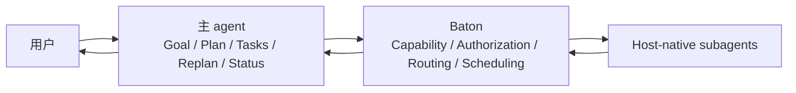
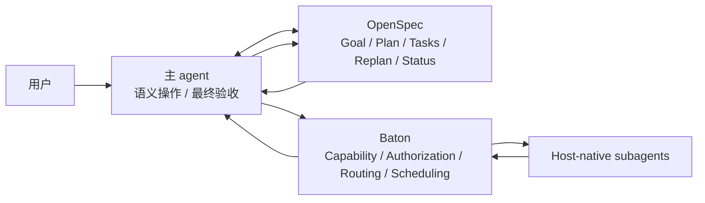
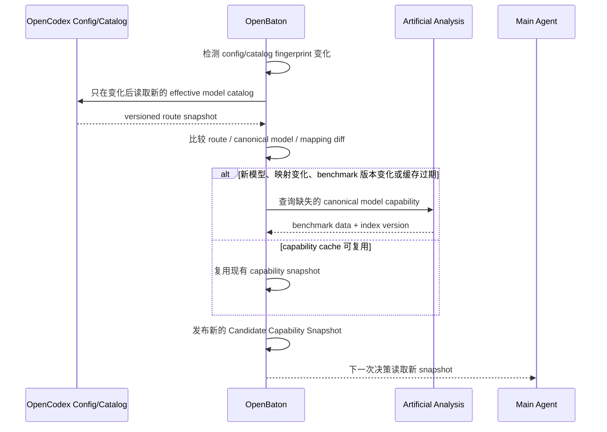
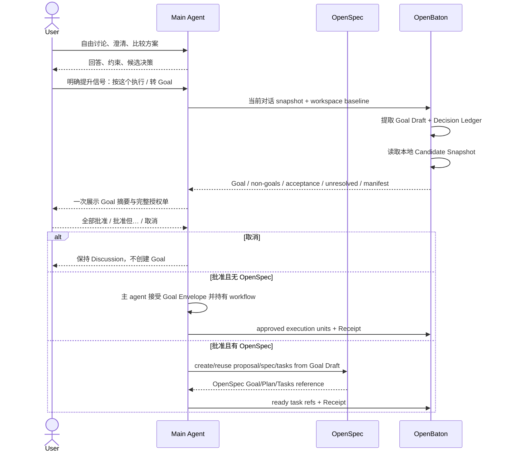
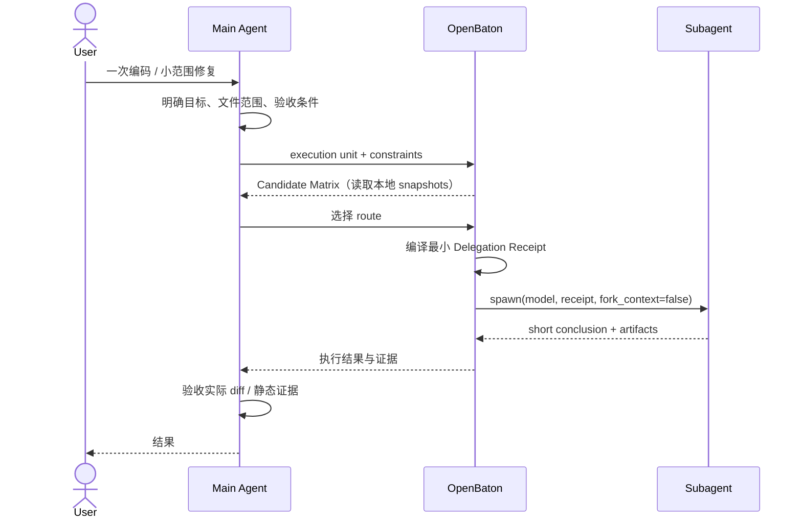
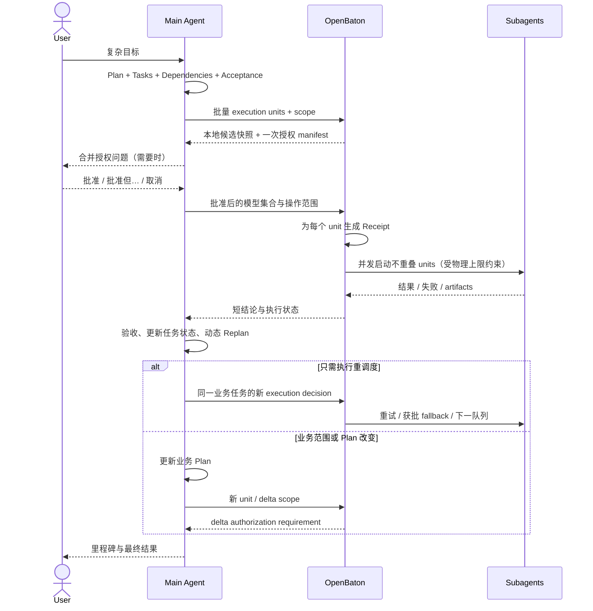
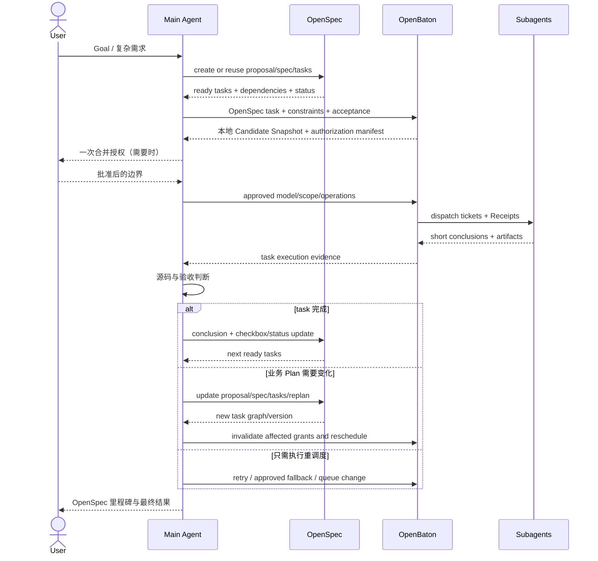

# Baton Dynamic Director Architecture

> 当前策略补充（2026-08-20）：OpenCodex catalog 继续完整可见，但 `gpt-5.5`、`gpt-5.6-sol` 与 `gpt-5.6-terra` 的所有 provider route、variant 和 reasoning profile 永久禁止进入 subagent 候选、显式选择或 dispatch。本文中的历史 route/fallback 讨论均受此内置门禁约束。

状态：Architecture Decision / Draft for implementation

日期：2026-08-18

范围：OpenBaton、OpenCodex、host-native subagent、可选 OpenSpec

## 0. 背景：为什么需要 Baton

### 0.1 已经具备的基础

Codex + OpenCodex 已经能在同一个父 session 中动态派生不同模型的 host-native subagent。OpenCodex 提供 provider/auth/model route，Codex 提供 `spawn_agent`、`wait_agent`、`send_input`、`close_agent` 等执行工具。

这解决了“能不能调用不同模型”，但没有解决“在一次真实工作中应该如何使用这些模型”。

主 agent 面对的仍然是原始能力：

```text
可用模型列表
+ spawn / wait / close
```

它缺少：

- 模型的权威能力证据和 route identity 映射；
- 针对具体任务的模型选择依据；
- 每个模型可操作文件、命令和副作用范围；
- 物理并发限制之上的逻辑队列；
- worker 失败、超时、fallback 和重试策略；
- 父子上下文卫生和短结论回收；
- 在多个 worker 之间保持 no-fallback、范围隔离和可审计执行。

### 0.2 OpenSpec 解决的问题不同

OpenSpec 解决业务层的 Goal、proposal/spec、Plan、Tasks、依赖、Replan 和 Status。它不负责：

- 哪个模型最适合当前 task；
- 当前 provider route 是否可用；
- 模型能力、速度、成本和 quota；
- subagent 并发、排队和生命周期；
- 每个 worker 的 delegation authorization。

因此 Baton 不是 OpenSpec 替代品。两者解决的是不同层次的问题：

```text
OpenSpec：工作是什么、计划是什么、进度是什么
Baton：交给哪个模型、允许做什么、什么时候运行
```

### 0.3 Baton 出现的原因

Baton 位于业务 workflow owner 与模型执行面之间：

```text
用户
  ↓
主 agent / OpenSpec
  ↓ execution unit
Baton
  ├─ 模型能力证据
  ├─ Delegation authorization
  ├─ Route 选择与 no-fallback
  ├─ 并发、队列、重试
  └─ Worker lifecycle / context hygiene
  ↓
OpenCodex + host-native subagents
```

Baton 的价值不是再造 Plan，而是让主 agent 可以安全、动态、可解释地使用一组能力不同的 subagent。

### 0.4 交互参与者

| 参与者 | 提供什么 | 不负责什么 |
| --- | --- | --- |
| 用户 | 目标、约束、授权、最终需求 | 不手动编排每个 worker |
| 主 agent | 无 OpenSpec 时的业务 workflow；语义判断与最终验收 | provider/auth、物理 worker 管理 |
| OpenSpec | 有 OpenSpec 时的 Goal/Plan/Tasks/Replan/Status | 模型选择和 subagent 调度 |
| OpenBaton | 能力证据、委派授权、route、调度、worker lifecycle | 业务 Plan 和业务状态 |
| OpenCodex | provider/auth/model catalog、route runtime | 业务决策和任务拆分 |
| Artificial Analysis | 独立模型能力、速度、成本评测 | 当前本机 route 可用性 |
| Host-native subagent | 独立上下文中的实际执行 | 扩大授权、业务验收、创建后代 agent |

### 0.5 从对话提升为 Goal

用户通常不是一开始就提供完整 Goal，而是先在当前 session 中讨论、澄清和收敛方案；当用户认为方向已经明确，再进入正式执行。

以前该转换由显式 `goal-preflight` skill 完成。OpenBaton需要把它变成内建的 Conversation-to-Goal 能力，用户不必说 skill 名，只需发出明确提升信号，例如：

```text
可以了，按这个执行
就按上面的方案做
转成 Goal
开始进入实施流程
```

仅表达认可但没有执行意图的“看起来可以”“先这样讨论”不应自动创建 Goal。

| 阶段 | 允许行为 | 状态 owner |
| --- | --- | --- |
| Discussion | 对话、只读调查、候选方案、约束澄清 | 主 agent session |
| Goal Draft | Baton 从对话编译结构化草案，尚未执行副作用 | Baton 临时 compiler output |
| Awaiting Approval | 主 agent向用户展示 Goal 摘要与一次授权单 | 当前前台对话 |
| Active Goal，无 OpenSpec | 主 agent持有 Goal/Plan/Tasks/Replan/Status | 主 agent |
| Active Goal，有 OpenSpec | Goal/Plan/Tasks/Replan/Status 落入 OpenSpec | OpenSpec |

Baton在这里是 compiler 和 authorization gateway，不是 Goal 的长期 owner。

## 1. 核心定义

Baton 是运行在主 agent 内的动态多模型 director 能力。用户始终只与主 agent 对话；Baton 不要求用户显式触发某个 workflow skill，也不成为第二套业务 workflow 或任务状态系统。

Baton 的职责是：

1. 在用户发出提升信号时，把当前对话编译成可确认的 Goal Draft 和一次授权单。
2. 维护由 OpenCodex 配置/catalog 变化驱动的本地 Route Snapshot。
3. 为 canonical model 维护可复用的权威 Capability Cache，并与 cards、健康度、额度和运行时信息合并。
4. 将候选能力证据交给主 agent 内的 Baton director 做模型决策。
5. 为选定模型编译最小 delegation authorization。
6. 使用 host-native subagent 执行任务，并负责并发、排队、重试、关闭和短结论回收。

Baton 不负责：

- 重新实现 OpenSpec。
- 持有业务 Goal、Plan、Tasks、Replan 或 Status。
- 代替主 agent 做最终业务验收。
- 重新实现 OpenCodex 的 provider、auth、model catalog 或 proxy。
- 通过外部 CLI print mode 执行 worker。

## 2. 所有权矩阵

| 能力 | 无 OpenSpec | 有 OpenSpec |
| --- | --- | --- |
| Goal / 需求 | 主 agent | OpenSpec proposal/spec |
| 业务 Plan | 主 agent | OpenSpec |
| 业务任务拆分 | 主 agent | OpenSpec tasks |
| 业务依赖关系 | 主 agent | OpenSpec |
| 业务动态重规划 | 主 agent | 更新 OpenSpec |
| 业务任务状态 | 主 agent | OpenSpec status/tasks |
| 语义判断与最终验收 | 主 agent | 主 agent 验收后写回 OpenSpec |
| 可执行模型列表 | OpenCodex | OpenCodex |
| 模型能力证据 | Baton capability layer | Baton capability layer |
| Delegation authorization | Baton | Baton |
| 模型路由与执行侧 fan-out | Baton | Baton |
| 并发、排队、重试、关闭 | Baton | Baton |
| Worker 中间上下文隔离 | Baton | Baton |

### 2.1 两类拆分不可混淆

业务任务拆分回答“做什么、依赖什么、何时完成”。有 OpenSpec 时，它只能由 OpenSpec 持有；没有 OpenSpec 时，由主 agent 持有。

执行侧 fan-out 回答“同一个业务任务交给几个模型、谁实施、谁审查、何时并行”。它属于 Baton，但不能产生新的业务完成语义。

例如一个 OpenSpec task 可以产生多个 Baton dispatch ticket：

```text
OpenSpec Task 2.3：修复 Session 生命周期竞态
├─ K3：分析生命周期与竞态窗口
├─ Grok：独立审查修复方案
└─ Kimi：在批准的文件 allowlist 内实施
```

这仍然只有一个 OpenSpec task。只有主 agent 验收必要结果后，才能更新该 task 状态。

### 2.2 两类重规划不可混淆

业务重规划包括新增/删除任务、修改依赖、扩大平台或文件范围、改变技术路线和验收条件：

- 无 OpenSpec：由主 agent 更新自己的 Plan。
- 有 OpenSpec：必须更新 OpenSpec；Baton 不维护平行 Plan。

执行重调度包括 worker 超时、route 不健康、并发槽位变化、在获批 fallback 内换模型、增加独立 review worker：

- 由 Baton 完成。
- 不改变业务任务树。
- 超出授权模型、范围或重试预算时触发 delta authorization。

## 3. 两种运行模式

### 3.1 无 OpenSpec



主 agent 是业务 workflow owner。Baton 只接收主 agent 提交的 execution unit，并返回 worker 结果与执行证据。

### 3.2 有 OpenSpec



OpenSpec 是业务任务和状态的唯一事实源。Baton 消费 task/status，但不得 invent proposal/spec/design/tasks/archive。

如果 OpenSpec task 过粗、缺少依赖或验收条件，Baton 返回 `requires_openspec_refinement`。主 agent 通过 OpenSpec 修正后再交回 Baton。

### 3.3 模型与能力数据刷新（非任务热路径）

OpenBaton 不应为每个任务重新查询 OpenCodex model list 或 Artificial Analysis。数据刷新属于独立控制面：



刷新触发条件：

- `~/.opencodex/config.json` 或 OpenCodex effective catalog 的内容指纹变化；
- OpenCodex 新增、删除或修改 route；
- canonical model mapping 变化；
- Artificial Analysis benchmark major/minor 版本变化；
- 新 canonical model 没有能力缓存；
- capability cache 到达显式 TTL；
- 用户手动要求 refresh。

不触发 catalog/AA 刷新的情况：

- 普通 execution unit 到达；
- 同一个模型再次被候选；
- worker 开始、完成或失败；
- 物理并发槽位变化；
- 只变化 route health、quota 或近期执行统计。

route health、quota 和近期执行证据可以由独立轻量 runtime monitor 更新，并与稳定的 Route Snapshot / Capability Cache 合并；不要求重拉 model list 或 benchmark。

### 3.4 Conversation-to-Goal



Goal Draft 至少包含：

```text
goal_objective
decision_ledger
explicit_constraints
inferred_constraints
unresolved_questions
non_goals
success_criteria
workspace_baseline
openspec_mode
candidate_model_matrix_ref
delegation_manifest
validation_boundary
commit_and_delivery_policy
```

每条内容必须标记来源：

- `explicit`：用户在对话中明确表达；
- `inferred`：主 agent/Baton 从上下文推导，必须在批准前展示；
- `unresolved`：仍会实质影响实现的歧义，必须在 Goal 激活前解决；
- `excluded`：明确不进入本次 Goal。

Conversation-to-Goal 的输出只在用户一次批准后冻结。批准前不得以 Goal 名义写代码、创建 OpenSpec change、build/test、stage、commit 或 push。

### 3.5 一次编码 / 简单任务

简单任务不要求创建 OpenSpec。主 agent 理解目标并形成一个边界清晰的 execution unit；OpenBaton 补齐模型能力证据和最小授权，然后派生一个 worker。



关键点：

- 主 agent 不需要用户手动触发 Baton skill。
- Baton 不创建业务 Plan，只消费一个 execution unit。
- 简单任务通常只启一个实施 worker；必要时可增加独立 review worker。
- 任一写入、build、test 或 Git 操作必须落在 Receipt 中。

### 3.6 复杂任务，无 OpenSpec

没有 OpenSpec 时，主 agent 是完整业务 workflow owner。主 agent 创建 Plan、拆分任务、维护依赖和状态，并在 worker 证据变化后动态重规划。OpenBaton只管理每个 execution unit 的模型与执行。



关键点：

- Baton 不保存一套平行业务 Task/Status。
- 主 agent 可以根据 worker 结果调整 Plan；Baton只重新调度执行。
- 逻辑 ticket 数量不受物理并发限制；物理 capacity 来自当前 host/session，历史 Codex V1 验收值 6 只是一条观测证据，不是产品常量。
- 已完成 worker 要及时关闭；terminal ticket 只有在 host 确认 `close_agent` 并记录 release 后才释放槽位。

### 3.7 复杂 Goal，有 OpenSpec

有 OpenSpec 时，Goal、Plan、Tasks、Dependencies、Replan 和 Status 全部归 OpenSpec。主 agent 通过 OpenSpec 创建或更新业务计划；OpenBaton消费 ready task 并调度 worker。



关键点：

- OpenSpec task 存在不等于某个模型自动获得写权限。
- OpenBaton仍为每个 dispatch ticket 编译 Delegation Receipt。
- 业务任务过粗时 Baton 返回 refinement requirement，不能自行增加 OpenSpec task。
- 业务 Replan 必须更新 OpenSpec；模型失败和并发变化可以只做 Baton 执行重调度。

## 4. 动态运行循环

Baton 不以手动 skill 调用启动。它作为主 agent 的常驻 director policy，在对话处理中循环运行：

```text
接收 execution unit
→ 读取本地 Route Snapshot / Capability Cache / runtime signals
→ 构建当前 Candidate Matrix
→ 主 agent 根据任务选择模型
→ Baton 编译 delegation authorization
→ 检查物理并发并排队
→ host-native spawn
→ 收集短结论与 artifacts
→ 主 agent 验收
→ Baton 根据执行状态重调度
→ 主 agent / OpenSpec 决定业务下一步
```

每次事件后可重新计算执行优先级：

- worker 完成或失败；
- provider health / quota 变化；
- 物理并发槽位释放；
- 前置依赖被验收；
- 主 agent 或 OpenSpec 更新业务 Plan；
- authorization 失效或发生 delta approval。

Baton 逻辑上可持有任意数量 dispatch ticket；物理运行数受 host/session 限制。历史 Codex V1 实测上限为 6 个 subagent，第 7 个返回 `AgentLimitReached`；当前实现不写死该值，并把超限作为 backpressure 放回 FIFO，而不是 ticket/route 失败。

## 5. Delegation Authorization

### 5.1 授权归属

Baton 可以拥有授权判断、授权编译、Receipt 和执行约束，但不能凭空创造用户权限。

```text
有效 worker grant
= 用户授权
∩ 主 agent 提交的 execution unit
∩ Baton 计算出的最小范围
∩ 选定模型和 route 的能力
∩ host / sandbox 实际权限
```

模型能力不等于模型权限。一个模型能完成大型重构，不代表它自动获得全仓写权限。

### 5.2 Receipt 最小字段

```yaml
receipt_id: BAR-<run>-<unit>-v1
unit_id: <main-agent-unit-or-openspec-task>
objective_digest: <digest>
requested_model: kimi/k3
allowed_models:
  - kimi/k3
fallback: none
scope:
  read:
    - src/video/**
  write:
    - src/video/Session.kt
operations:
  source_write: allowed
  static_check: allowed
  build_test: denied
  network: denied
  git_stage: denied
  git_commit: denied
limits:
  attempts: 2
  max_parallel: 1
  fork_context: false
approval_source: <user-message-or-standing-policy>
expires_on:
  - objective_change
  - scope_change
  - model_set_change
  - retry_budget_exhausted
```

缺失权限不得从相邻字段推断。状态使用 `allowed | conditional | denied | not_applicable`；批准前副作用状态为 `not_executed`，不是 `denied`。

### 5.3 Delta authorization

以下变化使受影响授权失效：

- 使用未获批模型或 provider route；
- 扩大读写范围；
- 新增 build/test/network/device/Git 操作；
- 超过重试次数；
- fallback 策略变化；
- OpenSpec task、主 agent Plan 或 objective 发生实质变化。

Baton 应在当前前台对话中一次性请求差异授权，而不是让 worker 自行扩大权限。

## 6. 模型能力数据链

### 6.1 输入来源

```text
OpenCodex catalog
  当前可执行 route、context、reasoning effort、provider

Artificial Analysis
  Intelligence / Coding / Agentic Index、速度、成本、延迟

Dynamic Cards
  OpenCodex exact route/profile + AA capability

Route runtime
  health、quota、延迟、近期执行证据
```

这些数据合并成 Candidate Capability Matrix，交给运行在主 agent 内的 Baton director 做最终模型决策。Baton 的底层库不把某个总分硬编码成“最佳模型”。

### 6.2 控制面刷新与任务热路径

OpenBaton 的能力数据分为稳定快照和动态信号：

| 数据 | 来源 | 刷新方式 | 普通任务是否远程查询 |
| --- | --- | --- | --- |
| Route Snapshot | OpenCodex effective catalog | 配置/catalog 指纹变化、显式 refresh | 否 |
| Canonical mapping | Baton committed mapping | route 或 mapping 变化 | 否 |
| Capability Cache | Artificial Analysis | cache miss、模型新增、benchmark 版本变化、TTL、显式 refresh | 否 |
| Dynamic Cards | Route Snapshot + Capability Cache | 任一输入变化 | 否 |
| Health / quota | route runtime | 独立轻量 monitor / provider event | 只读本地最新信号 |
| Recent evidence | Baton execution history | worker 终态事件 | 否 |

任务热路径：

```text
execution unit
→ 读取本地 Candidate Capability Snapshot
→ 主 agent 选择 route
→ 编译授权
→ spawn
```

刷新路径：

```text
OpenCodex config/catalog change
→ 更新 Route Snapshot
→ 识别新增/变化 canonical model
→ 只查询缺失或失效的 AA capability
→ 原子发布新 Candidate Snapshot
```

这样同一个模型的能力证据可跨任务复用，普通调度不依赖 Artificial Analysis 网络可用性。

### 6.3 权威评测源

第一数据源采用 Artificial Analysis Data API：

- API：<https://artificialanalysis.ai/data-api/docs>
- Capability Index 方法：<https://artificialanalysis.ai/methodology/capability-indices>
- Coding Index：<https://artificialanalysis.ai/models/capabilities/coding>
- Coding Agent Index：<https://artificialanalysis.ai/agents/coding-agents>

模型能力优先看 model-level Coding / Agentic / Intelligence 和 component benchmark。任何非 Codex harness 分数只能作为补充证据，不能直接当作 Codex host-native subagent 的模型能力。

### 6.4 Candidate 结构

```json
{
  "route_id": "kimi/k3[1m]",
  "canonical_model": "kimi-k3",
  "provider": "kimi",
  "available": true,
  "mapping": {
    "status": "variant",
    "confidence": "high"
  },
  "capability": {
    "coding_index": 72,
    "agentic_index": 75,
    "intelligence_index": 70,
    "terminal_bench_v2_1": 0.85,
    "scicode": 0.587
  },
  "runtime": {
    "context_window": 1048576,
    "reasoning_efforts": ["low", "high", "max"]
  },
  "economics": {
    "cost": null,
    "speed": null,
    "quota_remaining": null
  },
  "evidence": {
    "source": "artificial-analysis",
    "index_version": "4.1",
    "fetched_at": "<timestamp>",
    "stale": false
  }
}
```

示例数值只说明字段，不是当前实际 benchmark 数据。

### 6.5 模型身份映射

OpenCodex route 与评测站模型名称必须通过显式 canonical mapping 连接：

```text
exact | variant | family | unmatched
```

规则：

- 禁止 fuzzy match 后静默套用分数。
- `kimi/k3[1m]` 可引用 K3 的核心能力，但 context、价格、速度必须使用 route 自身数据。
- `cursor/grok-4.6-fast` 不得直接等同于 `xai/grok-4.6`；harness、provider 和 fast variant 都可能改变结果。
- 无可靠映射时标记 `unranked`，不伪造能力。
- 用户不能配置本地 model alias、route override 或 mapping override。

### 6.6 缓存与失效

- 使用版本化 capability cache，记录 source、index version、fetched_at、expires_at、canonical model 和 mapping version。
- 同一 canonical model + benchmark version + prompt profile 命中时直接复用，不发起远程请求。
- 仅在 cache miss、模型新增、mapping 变化、benchmark major/minor 变化、TTL 到期或显式 refresh 时查询 Artificial Analysis。
- 网络失败时使用 last-known-good，并向主 agent暴露数据年龄和 stale 状态。
- 无缓存时保留 route，但 capability 标记 `unranked`。
- 不混用不同 major/minor benchmark 版本的分数。
- 缓存更新采用原子替换；任务只读完整 snapshot，不读取半更新状态。
- API key 只允许安全凭据或环境变量提供，不写入 `~/.baton/config.toml`、日志或 worker prompt。

### 6.7 主 agent 决策维度

主 agent不选择“全局最强模型”，而是按 execution unit 选择最合适 route：

| 任务特征 | 主要证据 |
| --- | --- |
| 大仓探索、长上下文 | context window、agentic、Terminal-Bench |
| 源码实施 | Coding Index、Terminal-Bench、近期成功证据 |
| 科学计算 | SciCode |
| 快速小任务 | latency、speed、cost |
| 高风险审查 | reasoning、agentic、跨 provider 独立性 |
| 多视角 review | provider 多样性，不只按总分排序 |

## 7. Worker Lifecycle 与上下文

```text
planned → queued → starting → running → completed
                                  ├→ failed
                                  ├→ blocked
                                  └→ cancelled
```

每个 dispatch ticket 只记录 Baton 自己的执行事实：

```text
ticket_id
requested_model / effective_model
host_agent_id
receipt_id
work_unit.kind / deliverable / done_when
coordination.mode / latest_progress
queued/running/final status
attempt
timestamps
short_conclusion
artifact_paths
slot_released_at
```

它不是业务 task ledger。业务完成状态由主 agent 或 OpenSpec 持有。

Worker 默认 `fork_context=false`，使用自包含短 prompt 和可读取的 evidence 路径。`concrete` unit 只返回短结论；必要的 `deliberative` unit 使用 checkpointed 协调，只同步 phase、current result、next step 和 blocker/decision needed。中间推理、文件读取和工具输出留在独立上下文。

完成后 Baton 必须及时 `close_agent`，再用 `dispatch release` 确认物理槽位已释放，然后根据最新业务状态、授权和 route health 重新调度。

## 8. 失败、Fallback 与证据

- Catalog visible 不等于 route 可执行。
- `Unknown model`、provider error、`AgentLimitReached` 和 worker failure 必须分类记录。
- 用户未批准 fallback 时 `fallback: none`；禁止静默继承父模型或替换为其他 provider。
- 允许 fallback 时只能在 Receipt 的模型集合和重试预算内选择。
- Worker 自报 model ID 是辅助证据；实际 route 以 OpenCodex/host 运行证据为准。
- 能力数据缺失时标记 `unranked`；不能用名称、发布时间或厂商宣传补分。

## 9. 当前已验证基础

当前 Codex + OpenCodex 已验证：

- V1 `spawn_agent` 支持运行时 namespaced `model` 和 `reasoning_effort`。
- `fork_context=false` 可实现最小非全量上下文派生。
- `gpt-5.6-luna`、`cursor/grok-4.6-fast`、四个 Kimi route 和 `xai/grok-4.6` 均成功执行。
- 当前干净 V1 registry 同时保留 6 个 subagent，第 7 个触发限制。
- 父 session 可跨多轮继续动态派生不同模型。

详细证据见仓库根目录 `CODEX_OPENCODEX_DYNAMIC_SUBAGENT_VERIFICATION.md`。

## 10. 实现约束

1. Baton 的 host skill 是常驻 director policy；用户不需要手动调用 workflow skill。
2. CLI 可以保留 `spawn/apply/status` 作为调试和手动入口，但不是正常主路径。
3. Baton 持久化授权 Receipt 和 dispatch lifecycle，不持久化平行业务 Plan。
4. 有 OpenSpec 时 task/status 读写必须回到 OpenSpec；无 OpenSpec 时业务状态只在主 agent。
5. OpenCodex model/provider/auth 逻辑不进入 Baton。
6. Capability provider 必须可替换；Artificial Analysis 是默认第一实现，不是不可替换硬依赖。
7. 物理并发限制属于 host capability；逻辑 ticket 不因槽位不足被拒绝。
8. 主 agent始终保留最终验收、范围控制和业务语义裁决。

## 11. 整体可行性判断

> **当前状态（2026-08-19 RC）：`PASS / Codex 首版闭环通过`。** 144/144 tests、全局 `~/.baton` 状态、66-route Dynamic Cards、真实 8-ticket FIFO、write completion/error safety gate、OpenSpec stable-number writeback 和 provider no-fallback 日志均已通过。完整证据见 [OpenBaton Codex RC 验收报告](./openbaton-rc-validation-2026-08-19.md)。以下 11.1～11.8 保留的是实施前历史判定与验收规则，其中 `REVISE`、待集成和旧风险描述不再代表当前产品状态。

### 11.1 历史总体结论

当时结论是：**`REVISE / 技术可行，需按实测修订后实施`。**

2026-08-18 的验证性原型已经跑通 Conversation-to-Goal、能力快照、授权、队列、OpenSpec task round-trip 和写入型 worker 的组合闭环；但实测确认 Codex worker 共享父工作树、Git index 和 HEAD，prompt allowlist 也不是 host 强隔离。2026-08-19 已实现并实测 Artificial Analysis 本地 SQLite capability cache。OpenCodex 不锁死版本号，兼容性由运行时 capability probe 决定。

因此方案不是 `BLOCKED`，可以进入正式实现；实现必须采用 parent diff gate、父 agent Git ownership、稳定 OpenSpec task number 和真实 native ticket lifecycle。完整证据见 [OpenBaton Dynamic Director 可行性验证记录](./baton-dynamic-director-feasibility-validation.md)。

### 11.2 能力分级

| 模块 | 判断 | 依据 |
| --- | --- | --- |
| Conversation-to-Goal | 原型通过，待产品集成 | 显式提升、讨论态拒绝和 excluded 已通过验证性测试 |
| OpenSpec workflow | 已有基础 | OpenSpec 1.9 已有 change/spec/status/instructions/templates/validate/archive |
| OpenCodex route | 已验证基础 | provider/auth/catalog 和 namespaced model 已存在 |
| 动态 subagent | 已验证 | 7 个模型、跨轮 session、并发 6 已实测 |
| Route Snapshot | 原型通过，待产品集成 | 稳定 hash 和 generation 已验证 |
| Capability Cache | 已实现并实测 | AA Free API 拉取 608 个唯一模型；本地 SQLite、原子替换、显式 mapping、unranked 和 secret gate 已通过 |
| Delegation Receipt | 原型通过，待 native dispatch 集成 | model/path/operation/retry 已验证 fail-closed |
| Read-only 多模型 Goal | 端到端原型通过 | 简单任务和三 route 并发复杂任务已运行 |
| OpenSpec task 调度 | 端到端原型通过 | task number 插行稳定性和 OpenSpec 1.9 completion round-trip 已通过 |
| 写代码的 subagent | 机制通过，集成需修订 | 已确认 shared worktree；Kimi write worker + parent diff gate 通过 |
| 文件级强授权 | parent gate 原型通过 | host 不执行 prompt allowlist；越界 diff 由父 gate 拒绝 |
| 多宿主兼容 | 后续验证 | Codex 可先验证，其它 host 需要独立 adapter |
| 最终实施结论 | `REVISE` | 技术闭环可实现；需完成 host-native ticket lifecycle 和 parent safety gate 后再提升为 PASS |

### 11.3 已证明的底座与待证明的闭环

已证明：

```text
OpenSpec 1.9 提供业务 workflow 命令
OpenCodex 提供 provider/auth/catalog
Codex V1 支持 namespaced model 动态 spawn
7 个 route 已执行
同父 session 跨轮执行成立
物理并发上限 6 已测得
```

验证性原型已覆盖的完整闭环：

```text
当前对话
→ 用户提升为 Goal
→ Goal Draft + 一次授权
→ 有/无 OpenSpec 分流
→ 读取本地 Candidate Snapshot
→ 主 agent 选择模型
→ Baton 编译 Receipt
→ host-native spawn
→ 回收短结论
→ 主 agent 验收
```

这条闭环已在临时 fixture 中端到端运行，但尚未进入当前产品代码。原型通过不能替代正式集成、锁定版本和回归测试。

### 11.4 Gate A：实现机制与安全边界

正式实现完整系统前必须验证：

1. Worker 使用共享工作树、forked worktree 还是 patch/upload 通道。
2. 两个 worker 修改不重叠文件时如何合并。
3. allowlist 外修改能否拒绝导入。
4. Worker 的 staged index/commit 是否影响父仓。
5. close/resume 后 diff 与 artifact 的生命周期。
6. OpenCodex/host 运行时是否提供 model catalog、namespaced route、`reasoning_effort`、最小上下文派生和可分类终态；按 capability probe 判断，不锁死版本号。

验证结果决定写入集成：

| 观察结果 | 集成策略 |
| --- | --- |
| 修改直接进入父工作树 | 所有 worker 结束后执行严格 diff ownership/allowlist gate |
| 修改停留在 fork | 只选择性导入批准文件或 commit |
| Host 提供 patch/upload | 将该通道作为唯一批准导入面 |

V-01～V-05 的实测结论是 shared worktree/index/HEAD；parent diff gate 可以承接写入安全边界。Gate A 因当前产品尚未集成该安全闭环而判为 `REVISE`，不再由 OpenCodex 版本号阻塞。

### 11.5 现实工程风险

1. 历史实现曾基于 `agent_type/fork_turns`；当前 Codex-only 协议使用运行时 `model/reasoning_effort/fork_context`。
2. 当前 `baton spawn/apply` 只创建 ticket，没有真实调用 native spawn；ticket 还会在启动前被标成 `running`。
3. 当前 queue 默认 4，没有 agent ID、真实终态和自动出队；Codex V1 实测物理上限为 6。
4. 当前 OpenSpec conclusion 依赖行号，task 内容变化后可能漂移。
5. OpenCodex/host 兼容性必须由 capability probe 判断；catalog 可见但 spawn schema 或 route probe 不成立时明确 blocked，不能按版本号猜测。
6. Artificial Analysis 不覆盖或无法精确映射的 route 必须保留为 `unranked`。
7. 超长对话发生 compaction 时，Goal Draft 必须区分 `explicit/inferred/unresolved/excluded` 并交给用户确认。

### 11.6 Gate B：控制面原型

完成最小原型并验证：

```text
Conversation-to-Goal
+ OpenSpec 可选分流
+ Route Snapshot
+ Capability Cache
+ Delegation Receipt
+ Read-only native subagent
+ Queue / close / short conclusion
```

通过标准：

- 普通任务不重复查询 OpenCodex model list 或 Artificial Analysis；
- Conversation-to-Goal 不误触发，Draft 可追溯且一次批准后才激活；
- Ticket 状态与真实 agent ID、终态和槽位一致；
- 未授权 fallback、操作或文件范围不会执行；
- 无 OpenSpec 时不创建业务 ledger；有 OpenSpec 时不创建平行 Plan。

### 11.7 Gate C：端到端场景

必须依次通过：

1. 简单任务，无 OpenSpec。
2. 复杂任务，无 OpenSpec。
3. 复杂 Goal，有 OpenSpec。
4. 写入型 worker 闭环：

```text
worker worktree/patch 验证
→ diff/import gate
→ allowlisted implementation
→ build/test/commit 授权链
```

其它 host adapter 不阻塞 Codex 首版最终结论，但必须单独标记为未验证。

### 11.8 最终判定规则

| 结论 | 条件 |
| --- | --- |
| `PASS / 可实施` | Gate A、B、C 全部通过；无静默 fallback；授权和业务 owner 边界成立 |
| `PARTIAL / 部分可实施` | Conversation/read-only/OpenSpec 路径通过，但写入或强授权路径失败 |
| `REVISE / 需修订` | 机制可替代但当前设计假设错误，例如 worktree/import 模式与预期不同 |
| `BLOCKED / 不可实施` | Host 无法提供安全结果回收或 OpenSpec/OpenCodex 关键接口不满足闭环 |

该历史状态已经完成修订并复跑；当前结论以本节顶部 RC PASS 和独立验收报告为准。

## 12. 明确非目标

- 重新实现 OpenSpec。
- 在 Baton 内创建另一套 Goal/Plan/Task/Status。
- 让 benchmark 总分自动替代主 agent判断。
- 用外部 CLI print mode 代替 host-native subagent。
- 为缺失评测的模型编造能力分。
- 静默 fallback、默认模型或父模型继承。
- 让 worker 自己扩大权限、创建后代 agent 或决定业务完成。
